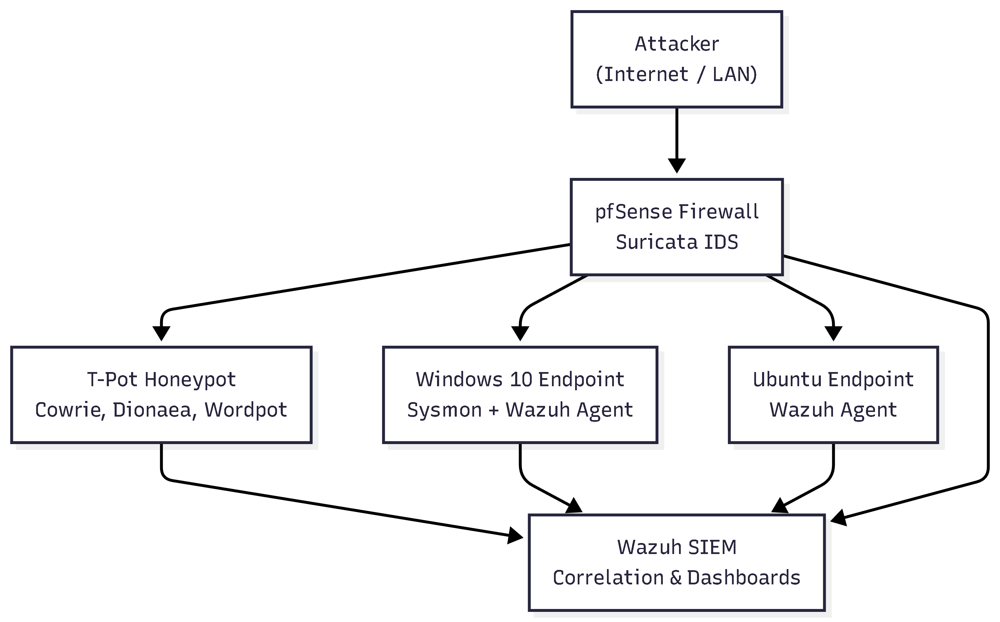

# Home-SOC-Lab-
This Project is a fully virtualized SOC environment designed to simulate real-world cyber defense operations. It includes a SIEM, honeypot, IDS/IPS, enhanced endpoint logging, and custom firewall rules, all monitored for threat detection and hunting.

## Architecture

| Component | Technology |
|----------|------------|
| SIEM & Central Logging | Wazuh / Elastic Stack |
| Firewall + IDS/IPS | pfSense + Suricata |
| Honeypot | T-Pot (multi-service honeypot) |
| Endpoints | Windows 10 + Ubuntu |
| Threat Simulation | Atomic Red Team & custom attacks |
| Log Parsing & Rules | Sigma → Wazuh custom detections |

---

## Objectives
- Detect, analyze, and respond to cyber attacks
- Perform threat hunting using real attack data
- Build detections mapped to MITRE ATT&CK
- Document incidents and SOC processes

---

## Key Features
- SSH & RDP brute-force detection
- Malware delivery attempts captured via honeypot
- PowerShell & Sysmon-based behavioral detection
- Suricata network-based threat analytics
- Custom dashboards & alert triage

---

## Threat Hunting Reports
| Attack | MITRE Technique | Report Link |
|--------|----------------|-------------|
| SSH brute force | T1110 | Docs/Threat-Hunting/Bruteforce-Report.md |
| Malicious PowerShell | T1059 | Docs/Threat-Hunting/PowerShell-Report.md |

---
